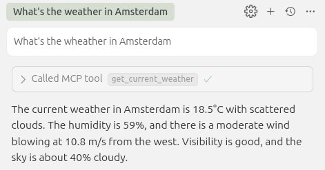
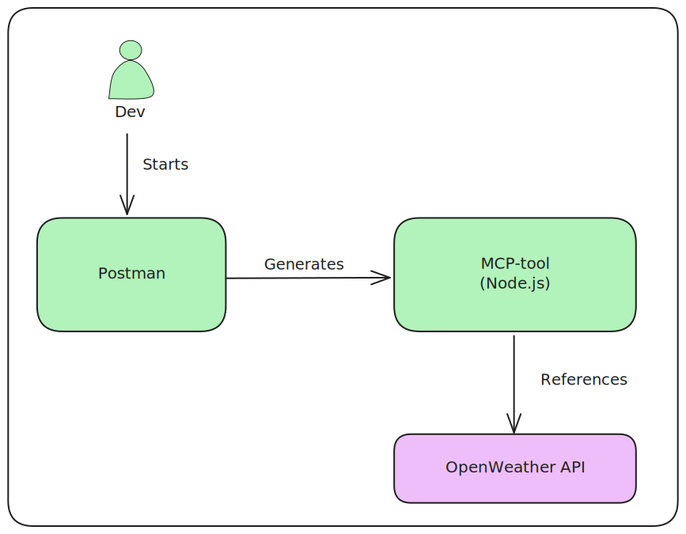
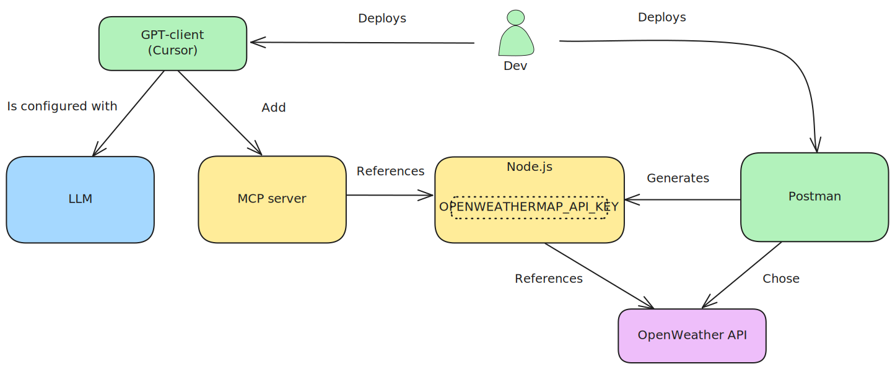
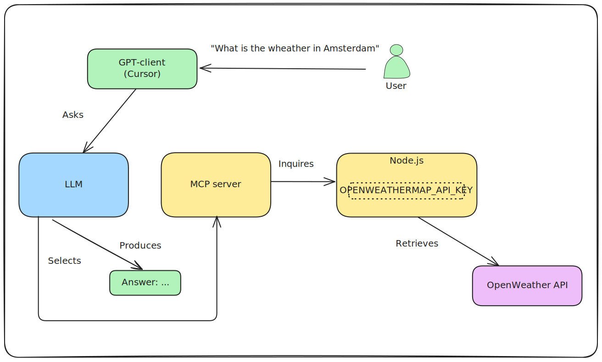

Explain the application of MCP:

- Generate a MCP server from Postman
- Deploy the server
- Test the server in Cursor (LLM orchestrator)

The MCP server connects to the OpenWeather API.

Credits:

- https://javascript.plainenglish.io/i-stopped-building-frontends-now-i-use-mcp-servers-to-let-ai-run-my-apps-178b0d7107ca

Actions as follows.

# Install cursor IDE

https://www.cursor.com/

# Install postman

    sudo snap install postman

# Start postman

    postman

Login with an account > free plan.

# Generate MCP server

In Postman:

- API network > MCP Generator
- Search > Openweathermap (by API Evangelist)
- Select APIs > Add Requests
- Generate
- Download ZIP
- Unzip ZIP

# Build MCP server

In src:

    npm install

# Run MCP server

    node mcpServer.js

# Add API key

The MCP server requires an API key to access the underlying API.

- In this example, we use the OpenWeather API

In OpenWeather:

- Create an account or sign-in
- Copy the API key
- https://openweathermap.org/api

In src/.env (not checked in):

- OPENWEATHERMAP_API_KEY=your_copied_key

Restart server:

    node mcpServer.js

# Add MCP server to LLM orchestrator

In this example, we use Cursor as orchestrator (for testing purposes)

- In Cursor > cursor settings > MCP tools > New MCP Server.
- Add args: "your-dir/mcpServer.js".
- your-dir = where you unzipped the mcpServer

Observe a green dot, indicating that the "tools" (i.e. the wrapped APIs) in the MCP-server are enabled.

- Sometimes selecting the disable/enable switch is required

# Test agent

In cursor, observe models:

- Cursor settings > Models

Ask a question to the models:

- Ctrl-I > "What's the wheather in Amsterdam" > Accept

The models select the right tool and produce an answer:

# Design

## Development

## Deployment

## Runtime

